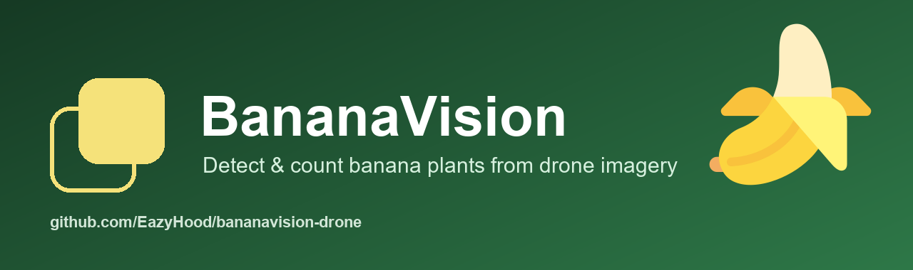

<div align="center">



**Banana plant detection, instance splitting, counting, and geospatial export for UAV imagery.**

[](https://github.com/EazyHood/bananavision-drone/releases)
[](https://github.com/EazyHood/bananavision-drone)
[](https://github.com/EazyHood/bananavision-drone/releases)
[](https://github.com/sponsors/EazyHood)
[](https://github.com/EazyHood)
[](LICENSE)

</div>

## Proof it works

Counting on **200 real UAV images the model never saw**: **3,132 actual plants vs 3,129 counted — 98% count accuracy** (5-fold cross-validation).


Detections land on real banana crowns, from sparse to very dense tiles:


Full evidence and honest caveats: [`docs/evidence/`](docs/evidence/).

Banana fields are harder than palm, avocado, mango, or other isolated-tree crops because one visible banana mat can contain several suckers/pseudostems and overlapping leaves. BananaVision treats this as an instance-separation problem, not just a box-detection problem.

## 🎯 Includes a model trained on REAL UAV imagery (ready to use)

Ships with a model **trained on REAL aerial UAV banana imagery, labeled plant by
plant** (open dataset [count-banana-plants](https://universe.roboflow.com/count-banana-plants/count-banana-plants),
CC-BY-4.0): `models/banana_real_v7.pt`. Use it directly, no training required:

```bash
pip install -e ".[ml,geo]"
bananavision infer YOUR_ORTHOPHOTO.tif --config configs/banana_real_model.yaml -o results
```

**Performance on the held-out real test set** (50 images, 1,166 plants, never seen;
YOLO11m detector at 1024 px, conf 0.25, IoU≥0.5 matching):

| Metric | Real value |
|---|---|
| **Recall** | **0.86** (finds 86% of plants) |
| **Precision** | **0.90** |
| **F1** | **0.88** |
| **mAP50** | **0.95** |

> **Real field figures** (nadir aerial view, per-plant labels), not synthetic. Trained with
> **real-crop copy-paste augmentation**, improving detection over earlier versions
> (F1 0.81 → 0.88, precision 0.82 → 0.90, recall 0.80 → 0.86 on the same held-out test).
> **Honest caveat:** measured on **a single region/farm** (the dataset's). In very dense mats
> some plants are occluded in the top-down view and can't be recovered in 2D; to truly raise the
> ceiling you need more data (more farms/altitudes). The pipeline supports this (`real_data/`,
> `bananavision train`).

**🏆 Maximum accuracy (ensemble):** for the best detection quality, use
`configs/banana_ensemble.yaml`, which fuses **two architectures (YOLOv8m + YOLO11m) with
Weighted Boxes Fusion** — held-out real test **F1 0.89** (precision 0.905, recall 0.878),
the best result of the whole model line. It runs both models, so it is ~2× slower than the
single-model default. Needs `pip install "bananavision-drone[ml]"` (includes `ensemble-boxes`).

### 🎯 Crop count accuracy: **98%** (validated by cross-validation)

For the **total crop count** —the number a farm cares about for its inventory—
the system reaches **~98% accuracy**, validated with **5-fold cross-validation over 200
real images the model never saw**:

| Cross-validation (out-of-fold) | Count error | Accuracy |
|---|---|---|
| Mean of 5 folds | **0.8%** | **99.2%** |
| Std across folds | ±0.52 pts | — |

Calibrated operating point: `confidence_threshold: 0.44` (correction factor ≈ 1.00, the
detector counts the crop **without bias**). Reproducible:

```bash
python real_data/calibrate_count.py --weights models/banana_real_v7.pt --data-root PATH/dataset
```

📊 **Visual evidence** (AI vs actual count, boxes over real plants, animation): see [`docs/evidence/`](docs/evidence/).

**What this 98% means (no fine print):**

- It is **AGGREGATE count accuracy over an area** (total plant inventory), **not** identifying
  98% of plants one by one. The **per-plant recall is ~0.86**:
  in very dense mats there are plants occluded in top-down view, unrecoverable in 2D.
- The total is accurate to 98% because, over an area of mixed density, undetected plants and
  false positives **offset each other stably** (standard in remote-sensing counting).
- Valid for **mixed-density** fields like this region. In a uniformly extreme-density
  field, **recalibrate** with a few local images (same script, minutes).

## What is included

- Immediate RGB baseline detector for high-resolution nadir drone images and orthomosaics.
- Production path for YOLO segmentation models, including training, validation, ONNX export, and TensorRT export.
- Banana-mat splitting logic based on expected crown diameter, canopy area, and peak separation.
- CSV, JSON, overlay image, GeoJSON, and KML outputs.
- Crown-center markers: a small dot on each banana crown (1–3 per mat, via radial-symmetry detection) inside every detection box, saved to the overlay and to each detection's `crown_centers`.
- Per-run manifest with config hash, model hash, environment, latency, and mission summary.
- Mission-level duplicate suppression for overlapping drone frames.
- World-file, GeoTIFF, and EXIF GPS georeference detection.
- Plant-level geospatial accuracy audit against field truth GeoJSON.
- FastAPI inference server for edge computers.
- Tested ROS2 and MAVLink companion-computer integration templates.
- Preflight readiness checks for config, model, dependencies, storage, and georeferencing.
- Capture coverage audit for missing frames, repeated positions, and large capture gaps.
- Mission image quality audit for blur, exposure, resolution, and georeferencing.
- Visual domain-shift audit against validated holdout imagery.
- One-command mission processing with QA gates, inference, optional inventory update, and HTML report.
- Mission-watch mode for processing images as a drone/companion computer writes them.
- Prediction quality audit for low-confidence, dense-cluster, edge, and duplicate-risk detections.
- Persistent plant inventory with stable IDs, snapshots, and flight-to-flight diffs.
- systemd unit generation for Jetson/Linux mission-watch and API services.
- Deployment smoke test that runs real inference on the target drone computer before flight.
- One-command `drone-ready` gate for package verification, preflight, smoke inference, deployment audit, and evidence indexing.
- Dataset audit tooling, acceptance gate, and latency benchmark for field validation.
- Batch acceptance gate for locked holdout folders.
- Stratified acceptance gate by farm, flight date, GSD band, cultivar, or custom field condition.
- Validation sample-size planning for 1% count-error and grouped-mat claims.
- Truth quality audit for duplicate centers, bad group IDs, oversized mats, and out-of-bounds points.
- Truth coverage audit for grouped banana-mat holdout support.
- Stratified truth-coverage audit by farm, flight date, GSD band, cultivar, or custom field condition.
- Synthetic banana cluster benchmark for regression testing grouped-mat splitting.
- Strict production model promotion gated by acceptance and benchmark reports.
- Evidence manifest with artifact hashes, reported statuses, and required-release checks.
- Release package builder with artifact hashes and ZIP export.
- Publication audit for GitHub readiness, CI, security, and operator docs.
- COCO and LabelMe annotation converters for YOLO segmentation training.
- Orthomosaic/dataset tiling with YOLO segmentation polygon clipping.
- Group-aware train/val/test splitting to avoid farm/block/flight leakage.
- Dataset quality report for invalid labels, duplicate leakage, split problems, and class counts.
- Active-learning review queue for low-confidence and dense-cluster cases.
- Review crop export for fast human QA.
- Cluster-review reports and crops for under/over-split grouped banana mats.
- Threshold calibration from predictions and field truth.
- Banana cluster-separation config tuning against field truth.
- Model registry manifests for promoted edge models.
- Static HTML field reports for audit and sharing.
- Jetson/ROS2/MAVLink starter integrations.

## Reality check

This project is usable immediately as software, but no public model can honestly guarantee 1% error on every banana farm without field data from that farm or a similar region. The repo is designed so a team can:

1. Run the baseline today.
2. Label a local UAV dataset.
3. Train a lightweight segmentation model.
4. Export it for edge deployment.
5. Validate plant-count error before operational use.

## Install

```bash
python -m venv .venv
.venv/Scripts/activate  # Windows
pip install -e ".[api,dev]"
```

For training and export:

```bash
pip install -e ".[ml,opencv,api,geo,dev]"
```

## Quick start

Create a synthetic banana scene:

```bash
bananavision synthetic \
  --image examples/synthetic_banana_scene.jpg \
  --truth examples/synthetic_banana_scene.truth.json \
  --plants 12 \
  --clustered-mats 2 \
  --min-plants-per-mat 3 \
  --max-plants-per-mat 3
```

Check that the example truth contains grouped banana mats:

```bash
bananavision truth-coverage examples/synthetic_banana_scene.truth.json \
  --output runs/synthetic_truth_coverage.json \
  --min-truth-count 12 \
  --min-cluster-count 2 \
  --min-cluster-truth-count 6
```

Run the grouped-mat regression benchmark:

```bash
bananavision cluster-benchmark --output runs/cluster_benchmark
```

Plan a validation set before promising 1% error:

```bash
bananavision validation-plan --output runs/validation/validation_plan.json
```

Run the immediate RGB baseline:

```bash
bananavision infer examples/synthetic_banana_scene.jpg --output runs/infer --config configs/banana_uav.yaml
```

Outputs:

- `*.detections.json`
- `*.detections.csv`
- `*.detections.geojson`
- `*.detections.kml`
- `*.overlay.jpg`
- `mission.detections.csv`
- `mission.detections.geojson`
- `mission.detections.kml`
- `run_manifest.json`

`run_manifest.json` records the config hash, model hash, runtime environment, latency, total detections, and mission-level duplicate suppression summary.

KML placemarks are written only when detections have lon/lat georeferencing. Pixel or projected coordinates remain available in CSV/GeoJSON.

## Train a production model

Prepare data in Ultralytics segmentation format:

```text
dataset/
  images/train/*.jpg
  images/val/*.jpg
  labels/train/*.txt
  labels/val/*.txt
  data.yaml
```

Audit before training:

```bash
bananavision audit-dataset dataset/data.yaml
```

Convert annotations if your labeling tool exports COCO or LabelMe:

```bash
bananavision annotations coco annotations/instances_train.json dataset/labels/train --target-name banana_plant
bananavision annotations labelme annotations/labelme dataset/labels/train --target-label banana_plant
```

Tile large UAV images or orthomosaics for YOLO training:

```bash
bananavision split-dataset raw/images raw/labels dataset_split \
  --manifest-csv raw/groups.csv \
  --train-ratio 0.7 \
  --val-ratio 0.2 \
  --test-ratio 0.1

bananavision tile-dataset dataset_split dataset_tiled \
  --split train \
  --tile-size 1024 \
  --overlap 128 \
  --min-polygon-area-px 64
```

Split by farm/block/flight before tiling so near-duplicate tiles do not leak from train into validation. The optional CSV must contain `image,group`.

Run a quality gate before training:

```bash
bananavision quality-report dataset_tiled/data.yaml --output runs/quality/quality_report.json
```

Train:

```bash
bananavision train dataset/data.yaml --model yolo26n-seg.pt --epochs 160 --imgsz 1024 --batch 8 --device 0
```

Validate:

```bash
bananavision validate dataset/data.yaml runs/banana/seg/weights/best.pt --imgsz 1024 --device 0
```

Export for edge:

```bash
bananavision export runs/banana/seg/weights/best.pt --format onnx --imgsz 1024
bananavision export runs/banana/seg/weights/best.pt --format engine --imgsz 1024 --half --device 0
```

Run trained inference:

```bash
bananavision infer /data/orthomosaic.tif --detector yolo-seg --model runs/banana/seg/weights/best.pt --gsd-cm 2.0 --crown-m 2.4
```

## Drone operation

Before a mission:

```bash
bananavision preflight \
  --input /data/mission/incoming \
  --output runs/preflight/preflight_report.json \
  --config configs/banana_uav.yaml \
  --model weights/best.pt \
  --detector yolo-seg
```

Check that the planned flight stays inside the validated model envelope:

```bash
bananavision flight-check \
  --output runs/flight_check/flight_check_report.json \
  --config configs/banana_uav.yaml \
  --gsd-cm 2.0 \
  --front-overlap 75 \
  --side-overlap 72 \
  --speed-mps 4 \
  --exposure-ms 4
```

If measured GSD is not available yet, estimate it from camera geometry:

```bash
bananavision flight-check \
  --altitude-m 60 \
  --sensor-width-mm 13.2 \
  --focal-length-mm 8.8 \
  --image-width-px 5472 \
  --front-overlap 75 \
  --side-overlap 72
```

`flight-check` writes a pass/warn/fail JSON report for GSD drift, overlap, and motion blur. It fails when the flight cannot be tied back to the GSD used in the inference config.

After the mission, audit the actual telemetry or capture log if your drone stack
exports a CSV with columns such as `image`, `gsd_cm`, `front_overlap`,
`side_overlap`, `speed_mps`, and `exposure_ms`:

```bash
bananavision flight-log-audit /data/mission/flight_log.csv \
  --output runs/flight_log/flight_log_audit.json \
  --config configs/banana_uav.yaml
```

This catches real altitude/GSD, overlap, speed, or shutter drift after takeoff.
It writes JSON and CSV evidence that can be attached to field reports and release
packages.

Audit capture coverage when the drone or camera controller exports image names
and positions:

```bash
bananavision capture-coverage /data/mission/capture_log.csv \
  --images /data/mission/incoming \
  --output runs/capture_coverage/capture_coverage_report.json \
  --require-image-files \
  --min-images 200 \
  --max-position-gap-m 35
```

This checks that logged frames exist on disk, positions are present, repeated
positions are not silently counted as fresh coverage, and large jumps between
captures are flagged before counts are trusted.

Build a visual-domain profile from validated holdout imagery, then compare the new mission against it:

```bash
bananavision domain-profile /data/holdout/images \
  --output runs/domain/domain_profile.json

bananavision domain-check /data/mission/incoming runs/domain/domain_profile.json \
  --output runs/domain/domain_check_report.json \
  --max-outlier-fraction 0
```

`domain-check` writes JSON and CSV evidence for color, luma, saturation, resolution, and histogram drift. It catches off-domain camera, lighting, crop-state, or processing changes before those images are trusted for counts.

After capture or during post-flight intake, audit image quality before trusting counts:

```bash
bananavision mission-quality /data/mission/incoming \
  --output runs/mission_quality/mission_quality_report.json \
  --min-width 1024 \
  --min-height 768 \
  --require-georef
```

The report writes JSON and CSV with per-image blur/focus score, exposure fractions, resolution, georeference type, EXIF GPS coordinates when present, and pass/warn/fail status.
EXIF GPS proves the capture is geotagged; plant-level map coordinates still require an orthomosaic, GeoTIFF/world-file transform, or equivalent camera geometry.

Validate plant-level map coordinates against surveyed or hand-verified GeoJSON points:

```bash
bananavision geo-accuracy runs/mission/mission.detections.geojson /data/holdout/plants.truth.geojson \
  --output runs/geo_accuracy/geo_accuracy_report.json \
  --tolerance-m 1 \
  --max-rmse-m 1 \
  --max-p95-m 1.5 \
  --min-recall 0.99
```

The report writes JSON and CSV match evidence. For production release, `release-audit` requires this artifact so plant coordinates cannot be treated as validated just because images have capture-level GPS.

Run the whole post-flight pipeline in one command:

```bash
bananavision mission-process /data/mission/incoming \
  --output runs/mission_process \
  --config configs/banana_uav.yaml \
  --detector yolo-seg \
  --model weights/best.pt \
  --require-georef \
  --inventory-dir farm_inventory
```

This writes mission image QA, inference outputs, prediction QA, an optional inventory update, `mission_process_manifest.json`, and `field_report.html`.

During a mission, watch a folder where the camera or companion-computer bridge writes images:

```bash
bananavision mission-watch /data/mission/incoming \
  --output runs/mission \
  --config configs/banana_uav.yaml \
  --detector yolo-seg \
  --model weights/best.pt
```

For post-flight smoke tests, add `--once` to process current files and exit.
`mission-watch` resumes from `mission_watch_state.json` after restart. Use `--no-resume` only when you intentionally want to reprocess existing images.

Audit prediction quality before publishing counts:

```bash
bananavision prediction-quality runs/mission \
  --output runs/prediction_quality/prediction_quality_report.json \
  --low-confidence 0.45 \
  --high-split-count 3 \
  --max-review-fraction 0.20
```

The report writes JSON and CSV flags for detections that need review because they are low-confidence, part of a dense banana cluster split, close to an image edge, crowded, or likely duplicated.

Before handing off mission counts, run the mission delivery audit:

```bash
bananavision mission-audit \
  runs/mission/run_manifest.json \
  runs/mission_quality/mission_quality_report.json \
  runs/prediction_quality/prediction_quality_report.json \
  --flight-check-report runs/flight_check/flight_check_report.json \
  --flight-log-report runs/flight_log/flight_log_audit.json \
  --capture-coverage-report runs/capture_coverage/capture_coverage_report.json \
  --require-capture-coverage \
  --domain-check-report runs/domain/domain_check_report.json \
  --geo-accuracy-report runs/geo_accuracy/geo_accuracy_report.json \
  --require-geo-accuracy \
  --output runs/mission_audit/mission_audit.json
```

This is the per-flight gate for reporting counts or updating inventory. It checks
the run manifest, capture QA, prediction QA, flight evidence, capture coverage,
domain evidence, and optional plant-coordinate accuracy evidence.

Update a persistent plant inventory after a mission:

```bash
bananavision inventory-update runs/mission/mission.detections.geojson farm_inventory \
  --distance-threshold 1.2 \
  --id-prefix banana-plant
```

The inventory writes stable plant IDs to `inventory.json`, `inventory.csv`, `inventory.geojson`, `inventory.kml`, and timestamped snapshots under `farm_inventory/snapshots/`.

Compare two inventory snapshots or a snapshot against the latest inventory:

```bash
bananavision inventory-diff \
  farm_inventory/snapshots/inventory_2026-07-03T12-00-00Z.json \
  farm_inventory/inventory.json \
  --output runs/inventory_diff
```

The diff writes `inventory_diff.json`, plus GeoJSON/KML layers for new and missing plants.

Generate Linux systemd service files for a Jetson/companion computer:

```bash
bananavision deploy-systemd \
  --output edge/systemd \
  --install-dir /opt/bananavision-drone \
  --user bananavision \
  --bin /opt/bananavision-drone/.venv/bin/bananavision \
  --config /opt/bananavision-drone/configs/banana_uav.yaml \
  --model /models/best.pt \
  --watch-dir /data/mission/incoming \
  --mission-output /data/mission/output
```

This writes hardened systemd units, `README.systemd.md`, and
`deployment_manifest.json`. The manifest records target paths, service names,
health-check commands, the generated preflight command, and the operational gates
that must pass before flight.

Create an active-learning review queue from uncertain predictions:

```bash
bananavision review-queue runs/infer --output runs/active_learning/review_queue.json
bananavision review-crops runs/active_learning/review_queue.json --output runs/active_learning/review_crops
```

Calibrate confidence thresholds against field truth:

```bash
bananavision calibrate runs/infer/block-a.detections.json /data/holdout/block-a.truth.json \
  --output runs/calibration/block-a.calibration.json \
  --tolerance-px 24
```

Review grouped banana mats that failed individual splitting:

```bash
bananavision cluster-review runs/infer/block-a.detections.json /data/holdout/block-a.truth.json \
  --output runs/cluster_review/block-a.cluster_review.json \
  --tolerance-px 24 \
  --crops-dir runs/cluster_review/crops
```

The JSON/CSV report lists each grouped mat, missing truth centers, extra
predictions near the mat, and a review bbox. Crops are exported only for failed
mats so labeling/model fixes can focus on the true banana grouping problem.

Tune the banana individual-splitting parameters for a specific farm/GSD:

```bash
bananavision tune-config /data/calibration/block-a.tif /data/calibration/block-a.truth.json \
  --config configs/banana_uav.yaml \
  --output runs/tuning/block-a.tuning.json \
  --output-config runs/tuning/block-a.tuned.yaml \
  --tolerance-px 24 \
  --crown-m 1.8 --crown-m 2.2 --crown-m 2.6 \
  --min-distance-ratio 0.35 --min-distance-ratio 0.42 --min-distance-ratio 0.50 \
  --center-distance-weight 0.2 --center-distance-weight 0.35 --center-distance-weight 0.6 \
  --max-split-instances 8 --max-split-instances 12 --max-split-instances 16
```

`center_distance_weight` helps split grouped mats when a segmentation mask has a
flat confidence map; higher values trust distance-to-edge peaks more. Use the
tuned YAML for inference only after validating it on a separate holdout set.

## Acceptance gate

Use this before claiming a model is production-ready. The command exits with code `2` if the model fails the configured thresholds:

```bash
bananavision acceptance /data/holdout/block-a.tif /data/holdout/block-a.truth.json \
  --config configs/banana_uav.yaml \
  --detector yolo-seg \
  --model weights/best.pt \
  --tolerance-px 24 \
  --max-count-error-rate 0.01 \
  --min-precision 0.99 \
  --min-recall 0.99 \
  --min-f1 0.99 \
  --min-cluster-count 20 \
  --min-cluster-recall 0.99 \
  --min-cluster-full-detection-rate 0.99
```

Truth JSON can be simple:

```json
{
  "centers": [
    { "x": 123.4, "y": 567.8 },
    { "x": 223.4, "y": 667.8 }
  ]
}
```

For banana mats, annotate individuals that belong to the same mat or clump with the
same `group_id`/`group`/`cluster_id`/`cluster`/`mat_id` value:

```json
{
  "centers": [
    { "x": 123.4, "y": 567.8, "group_id": "mat-001" },
    { "x": 142.0, "y": 573.1, "group_id": "mat-001" },
    { "x": 166.8, "y": 562.4, "group_id": "mat-001" }
  ]
}
```

Cluster gates catch the banana-specific failure mode where total count error looks
acceptable but the detector merged or duplicated individuals inside a grouped mat.

For commercial validation, first plan the minimum field truth support:

```bash
bananavision validation-plan \
  --output runs/validation/validation_plan.json \
  --target-count-error-rate 0.01 \
  --target-cluster-recall-loss 0.01 \
  --target-cluster-full-detection-loss 0.01 \
  --farms 3 \
  --flight-dates 3 \
  --gsd-bands 2 \
  --cultivars 1
```

The report writes recommended thresholds for `truth-coverage`,
`stratified-truth-coverage`, `holdout-lock`, `acceptance-batch`, and
`release-audit`. It is a sampling plan, not evidence that the model passes.

Then use a locked holdout folder:

```bash
bananavision holdout-lock /data/holdout/images /data/holdout/truth_manifest.json \
  --output runs/holdout/holdout_lock.json \
  --target-count-error-rate 0.01

bananavision holdout-verify runs/holdout/holdout_lock.json \
  --output runs/holdout/holdout_verify.json

bananavision truth-quality /data/holdout/truth_manifest.json \
  --images /data/holdout/images \
  --output runs/holdout/truth_quality_report.json

bananavision truth-coverage /data/holdout/truth_manifest.json \
  --images /data/holdout/images \
  --output runs/holdout/truth_coverage_report.json \
  --min-truth-count 1000 \
  --min-cluster-count 100 \
  --min-cluster-truth-count 300 \
  --min-cluster-images 30 \
  --min-cluster-truth-fraction 0.20

bananavision stratified-truth-coverage /data/holdout/truth_manifest.json /data/holdout/metadata.csv \
  --images /data/holdout/images \
  --output runs/stratified_truth_coverage/stratified_truth_coverage_report.json \
  --strata farm --strata flight_date --strata gsd_band --strata cultivar \
  --min-truth-count 50 \
  --min-cluster-count 10 \
  --min-cluster-truth-count 30 \
  --min-cluster-images 5 \
  --min-cluster-truth-fraction 0.20
```

The lock records image hashes, truth hashes, truth counts, banana-mat cluster
support, and the minimum detectable count error and cluster-loss rates. Re-run
`holdout-verify` before every release. `truth-quality` catches annotation defects
such as duplicate centers, singleton group IDs, oversized groups, and points
outside image bounds. `truth-coverage` proves the validation set actually
contains enough grouped banana mats before cluster metrics are used for
production claims. `stratified-truth-coverage` proves that support exists inside
each claimed field condition, not only in the global holdout average.

```bash
bananavision acceptance-batch /data/holdout/images /data/holdout/truth_manifest.json \
  --holdout-lock runs/holdout/holdout_lock.json \
  --config configs/banana_uav.yaml \
  --detector yolo-seg \
  --model weights/best.pt \
  --tolerance-px 24 \
  --max-count-error-rate 0.01 \
  --max-mean-image-count-error-rate 0.03 \
  --min-precision 0.99 \
  --min-recall 0.99 \
  --min-f1 0.99 \
  --min-truth-count 1000 \
  --min-cluster-count 100 \
  --min-cluster-recall 0.99 \
  --min-cluster-full-detection-rate 0.99 \
  --min-precision-ci-lower 0.98 \
  --min-recall-ci-lower 0.98
```

Batch reports include sample support, Wilson confidence intervals for precision/recall,
cluster recall evidence, cluster full-detection evidence, and a confidence interval
for mean per-image count error. For a 1% claim, use enough ground-truth plants that
one missed or extra plant would be visible in the reported support.
When `--holdout-lock` is supplied, `acceptance-batch` writes `holdout_verify.json` and stops before inference if the locked holdout changed.

Gate the same acceptance report by field condition:

```bash
bananavision stratified-acceptance runs/acceptance_batch/acceptance_batch_report.json /data/holdout/metadata.csv \
  --output runs/stratified_acceptance/stratified_acceptance_report.json \
  --strata farm --strata flight_date --strata gsd_band --strata cultivar \
  --max-count-error-rate 0.01 \
  --min-precision 0.99 \
  --min-recall 0.99 \
  --min-f1 0.99 \
  --min-truth-count 50 \
  --min-cluster-count 10 \
  --min-cluster-recall 0.99 \
  --min-cluster-full-detection-rate 0.99
```

`metadata.csv` must include `image` and the selected strata columns. This gate
prevents a model from passing a 1% global average while failing a specific farm,
date, GSD band, cultivar, or other field condition.

`truth_manifest.json` can contain:

```json
{
  "images": [
    { "image": "block-a-001.jpg", "centers": [{ "x": 123.4, "y": 567.8 }] },
    { "image": "block-a-002.jpg", "centers": [[223.4, 667.8]] }
  ]
}
```

Alternatively, pass a truth directory containing `image_stem.truth.json` files.

## Benchmark

Measure edge latency on the actual drone computer:

```bash
bananavision benchmark /data/mission/images --config configs/banana_uav.yaml --runs 5 --warmup 1
```

The report includes median, p95, max latency, config hash, and model hash.

## Register a promoted model

For experiments, register a model manifest:

```bash
bananavision register-model weights/best.pt banana-field-v1 \
  --config configs/banana_uav.yaml \
  --acceptance-report runs/acceptance/acceptance_report.json \
  --benchmark-report runs/benchmark/benchmark_report.json \
  --notes "Validated on farm block A, 2 cm GSD"
```

This writes `models/registry/banana-field-v1.json` and `models/registry/latest.json`.

For production, use strict promotion. This fails if acceptance did not pass or if latency exceeds the optional p95 limit:

```bash
bananavision promote-model weights/best.pt banana-field-v1 \
  runs/acceptance_batch/acceptance_batch_report.json \
  runs/benchmark/benchmark_report.json \
  --config configs/banana_uav.yaml \
  --max-p95-ms 250 \
  --notes "Locked holdout passed, Jetson p95 under 250 ms"
```

Generate a model card from release evidence:

```bash
bananavision model-card \
  --output docs/MODEL_CARD.generated.md \
  --model-name "BananaVision field model" \
  --version banana-field-v1 \
  --model-manifest models/registry/latest.json \
  --acceptance-report runs/acceptance_batch/acceptance_batch_report.json \
  --stratified-acceptance-report runs/stratified_acceptance/stratified_acceptance_report.json \
  --benchmark-report runs/benchmark/benchmark_report.json \
  --mission-quality-report runs/mission_quality/mission_quality_report.json \
  --prediction-quality-report runs/prediction_quality/prediction_quality_report.json \
  --flight-log-report runs/flight_log/flight_log_audit.json \
  --domain-check-report runs/domain/domain_check_report.json \
  --geo-accuracy-report runs/geo_accuracy/geo_accuracy_report.json \
  --validation-plan-report runs/validation/validation_plan.json \
  --truth-quality-report runs/holdout/truth_quality_report.json \
  --truth-coverage-report runs/holdout/truth_coverage_report.json \
  --stratified-truth-coverage-report runs/stratified_truth_coverage/stratified_truth_coverage_report.json
```

The generated card states whether a 1% claim is supported by the provided
evidence or still unproven, whether grouped banana-mat truth coverage exists per
claimed field condition, and whether plant-level coordinates have matching
evidence.

Run the final release audit before publishing a model:

```bash
bananavision release-audit \
  --output runs/release_audit/release_audit.json \
  --acceptance-report runs/acceptance_batch/acceptance_batch_report.json \
  --stratified-acceptance-report runs/stratified_acceptance/stratified_acceptance_report.json \
  --benchmark-report runs/benchmark/benchmark_report.json \
  --mission-quality-report runs/mission_quality/mission_quality_report.json \
  --prediction-quality-report runs/prediction_quality/prediction_quality_report.json \
  --holdout-verify-report runs/acceptance_batch/holdout_verify.json \
  --validation-plan-report runs/validation/validation_plan.json \
  --truth-quality-report runs/holdout/truth_quality_report.json \
  --truth-coverage-report runs/holdout/truth_coverage_report.json \
  --stratified-truth-coverage-report runs/stratified_truth_coverage/stratified_truth_coverage_report.json \
  --flight-check-report runs/flight_check/flight_check_report.json \
  --flight-log-report runs/flight_log/flight_log_audit.json \
  --domain-check-report runs/domain/domain_check_report.json \
  --geo-accuracy-report runs/geo_accuracy/geo_accuracy_report.json \
  --model-manifest models/registry/latest.json \
  --model-card docs/MODEL_CARD.generated.md \
  --field-report runs/reports/field_report.html \
  --max-count-error-rate 0.01 \
  --min-truth-count 1000 \
  --min-cluster-count 100 \
  --min-cluster-truth-count 300 \
  --min-cluster-images 30 \
  --min-cluster-truth-fraction 0.20 \
  --min-cluster-recall 0.99 \
  --min-cluster-full-detection-rate 0.99 \
  --min-precision-ci-lower 0.98 \
  --min-recall-ci-lower 0.98 \
  --max-p95-ms 250 \
  --max-geo-rmse-m 1 \
  --max-geo-p95-m 1.5 \
  --min-geo-recall 0.99
```

The audit exits non-zero if critical release evidence is missing or does not meet the configured gates. A 1% count-error claim requires a validation-plan report, a passing truth-quality report, passing global and stratified truth coverage, and enough acceptance support to satisfy it.

Create a machine-readable evidence manifest before packaging:

```bash
bananavision evidence-manifest \
  --output runs/evidence/evidence_manifest.json \
  --run-manifest runs/infer/run_manifest.json \
  --mission-audit-report runs/mission_audit/mission_audit.json \
  --mission-quality-report runs/mission_quality/mission_quality_report.json \
  --prediction-quality-report runs/prediction_quality/prediction_quality_report.json \
  --flight-check-report runs/flight_check/flight_check_report.json \
  --flight-log-report runs/flight_log/flight_log_audit.json \
  --capture-coverage-report runs/capture_coverage/capture_coverage_report.json \
  --domain-check-report runs/domain/domain_check_report.json \
  --geo-accuracy-report runs/geo_accuracy/geo_accuracy_report.json \
  --validation-plan-report runs/validation/validation_plan.json \
  --truth-quality-report runs/holdout/truth_quality_report.json \
  --truth-coverage-report runs/holdout/truth_coverage_report.json \
  --stratified-truth-coverage-report runs/stratified_truth_coverage/stratified_truth_coverage_report.json \
  --acceptance-report runs/acceptance_batch/acceptance_batch_report.json \
  --stratified-acceptance-report runs/stratified_acceptance/stratified_acceptance_report.json \
  --benchmark-report runs/benchmark/benchmark_report.json \
  --cluster-review-report runs/cluster_review/block-a.cluster_review.json \
  --model-manifest models/registry/latest.json \
  --model-card docs/MODEL_CARD.generated.md \
  --field-report runs/reports/field_report.html \
  --release-audit-report runs/release_audit/release_audit.json \
  --model weights/best.engine \
  --config configs/banana_uav.yaml \
  --require release_audit_report \
  --require acceptance_report \
  --require benchmark_report \
  --require validation_plan_report \
  --require truth_quality_report \
  --require truth_coverage_report \
  --require stratified_truth_coverage_report \
  --require model_manifest \
  --require model_card \
  --require field_report \
  --require model \
  --require config
```

The manifest records SHA256 hashes, file sizes, and the pass/warn/fail status reported by JSON artifacts. It exits non-zero if a required artifact is missing or any supplied report declares failure.

Audit the repository before publishing it publicly:

```bash
bananavision publication-audit . \
  --output runs/publication/publication_audit.json
```

This checks for CI, package metadata, license, security policy, contribution guide,
operator manual, failure-mode guide, and documented validation/release flow.

Package a passing release for GitHub or field handoff:

```bash
bananavision release-package runs/release_audit/release_audit.json \
  --output dist \
  --package-name banana-v1 \
  --model weights/best.engine \
  --config configs/banana_uav.yaml \
  --model-manifest models/registry/latest.json \
  --model-card docs/MODEL_CARD.generated.md \
  --field-report runs/reports/field_report.html \
  --stratified-acceptance-report runs/stratified_acceptance/stratified_acceptance_report.json \
  --evidence-manifest runs/evidence/evidence_manifest.json \
  --mission-audit-report runs/mission_audit/mission_audit.json \
  --acceptance-report runs/acceptance_batch/acceptance_batch_report.json \
  --benchmark-report runs/benchmark/benchmark_report.json \
  --mission-quality-report runs/mission_quality/mission_quality_report.json \
  --prediction-quality-report runs/prediction_quality/prediction_quality_report.json \
  --holdout-verify-report runs/acceptance_batch/holdout_verify.json \
  --validation-plan-report runs/validation/validation_plan.json \
  --truth-quality-report runs/holdout/truth_quality_report.json \
  --truth-coverage-report runs/holdout/truth_coverage_report.json \
  --stratified-truth-coverage-report runs/stratified_truth_coverage/stratified_truth_coverage_report.json \
  --flight-check-report runs/flight_check/flight_check_report.json \
  --flight-log-report runs/flight_log/flight_log_audit.json \
  --domain-check-report runs/domain/domain_check_report.json \
  --geo-accuracy-report runs/geo_accuracy/geo_accuracy_report.json \
  --deployment-manifest edge/systemd/deployment_manifest.json
```

This writes `dist/banana-v1/release_package_manifest.json` plus `dist/banana-v1.zip`. The manifest contains SHA256 hashes for every packaged artifact and refuses failed release audits unless `--allow-failed-audit` is explicitly supplied for debugging. Existing package folders are not reused; pass `--overwrite` only when intentionally regenerating the same package name.

Verify the package after copying it to GitHub releases, another workstation, or the drone computer:

```bash
bananavision release-package-verify dist/banana-v1.zip \
  --output runs/release_package/verify_report.json \
  --require-deployment-artifacts
```

The verifier recalculates every artifact hash, checks the manifest hash, confirms the release audit status, and exits non-zero if a production package was modified, is actually exploratory, or lacks the model/config/evidence/deployment artifacts needed on a drone.

After installing on the drone computer, run a real inference smoke test against a known-good image:

```bash
bananavision deployment-smoke-test /data/smoke/banana_smoke.jpg \
  --output runs/deployment_smoke/deployment_smoke_report.json \
  --artifacts-dir runs/deployment_smoke/artifacts \
  --config configs/banana_uav.yaml \
  --detector yolo-seg \
  --model weights/best.engine \
  --min-detections 1 \
  --max-image-latency-ms 250
```

After the smoke test passes, audit the installed package, target-machine preflight report, deployment manifest, and smoke report together:

```bash
bananavision deployment-audit dist/banana-v1 \
  runs/preflight/preflight_report.json \
  edge/systemd/deployment_manifest.json \
  --output runs/deployment/deployment_audit.json \
  --deployment-smoke-report runs/deployment_smoke/deployment_smoke_report.json
```

This is the last local gate before flight: it fails when package integrity, deployment-artifact completeness, preflight readiness, service commands, or target-machine inference are not production-ready.

For the final drone-machine handoff, rerun `evidence-manifest` with
`--deployment-smoke-report` and `--deployment-audit-report` so the installed
runtime evidence is indexed with the release artifacts.

For routine operations, use the one-command final gate:

```bash
bananavision drone-ready dist/banana-v1 \
  edge/systemd/deployment_manifest.json \
  /data/smoke/banana_smoke.jpg \
  --output runs/drone_ready \
  --config configs/banana_uav.yaml \
  --detector yolo-seg \
  --model weights/best.engine \
  --min-detections 1 \
  --max-image-latency-ms 250
```

This writes preflight, smoke, deployment-audit, evidence-manifest, and summary
reports under `runs/drone_ready`.

Generate a static field report:

```bash
bananavision field-report \
  --output runs/reports/field_report.html \
  --run-manifest runs/infer/run_manifest.json \
  --mission-audit-report runs/mission_audit/mission_audit.json \
  --mission-quality-report runs/mission_quality/mission_quality_report.json \
  --prediction-quality-report runs/prediction_quality/prediction_quality_report.json \
  --flight-check-report runs/flight_check/flight_check_report.json \
  --flight-log-report runs/flight_log/flight_log_audit.json \
  --capture-coverage-report runs/capture_coverage/capture_coverage_report.json \
  --domain-check-report runs/domain/domain_check_report.json \
  --geo-accuracy-report runs/geo_accuracy/geo_accuracy_report.json \
  --validation-plan-report runs/validation/validation_plan.json \
  --truth-quality-report runs/holdout/truth_quality_report.json \
  --truth-coverage-report runs/holdout/truth_coverage_report.json \
  --stratified-truth-coverage-report runs/stratified_truth_coverage/stratified_truth_coverage_report.json \
  --acceptance-report runs/acceptance/acceptance_report.json \
  --stratified-acceptance-report runs/stratified_acceptance/stratified_acceptance_report.json \
  --benchmark-report runs/benchmark/benchmark_report.json \
  --tuning-report runs/tuning/block-a.tuning.json \
  --cluster-review-report runs/cluster_review/block-a.cluster_review.json \
  --release-audit-report runs/release_audit/release_audit.json \
  --model-manifest models/registry/latest.json
```

Use this report as the handoff artifact for agronomy teams, QA, and model-release review.

## API

```bash
bananavision serve --config configs/banana_uav.yaml --host 0.0.0.0 --port 8080
```

Use `GET /health` for liveness and `GET /ready` to confirm the config, detector,
runtime fingerprint, and model metadata were loaded. Then send an image to
`POST /infer`.

For field networks, set `BANANAVISION_API_KEY` in the service environment and
send it as `X-API-Key` or `Authorization: Bearer <token>` on `POST /infer`.
Uploads are limited to 25 MB by default; change this with `--max-upload-mb`.
The generated systemd API service reads `BANANAVISION_API_KEY` from its
environment instead of putting secrets in `ExecStart`.

## Research basis

The design follows published banana-UAV findings: RGB image variants and altitude ensembles improved recall in PLOS One 2019; multi-temporal multispectral work showed that individual banana crown detection remains difficult when crowns overlap; recent lightweight YOLO segmentation work targets banana plantation segmentation under UAV constraints.

See [docs/REFERENCES.md](docs/REFERENCES.md).

## 💚 Support this project

BananaVision is free to use. It's a young project I build and improve on my own — if it saves
you time in the field, a small donation helps me keep training better models and adding
features. No pressure: everything here stays free.

- **GitHub Sponsors** — [Sponsor @EazyHood](https://github.com/sponsors/EazyHood) (one-time or monthly).

The **Sponsor** button also appears at the top of this repository.

## Author and license

**Author and sole holder of all rights: Jhonatan del Rio Mejia.** Copyright © 2026 Jhonatan del Rio Mejia.

**Proprietary license — All rights reserved.** **Sale**, resale, sublicensing, or any
commercial exploitation, in whole or in part, is **PROHIBITED** without the author's
express written permission. Personal, educational, research, and evaluation use is
permitted provided this notice is retained. See [LICENSE](LICENSE).

The included model was trained on data under CC-BY-4.0 (attribution in [NOTICE](NOTICE)).
