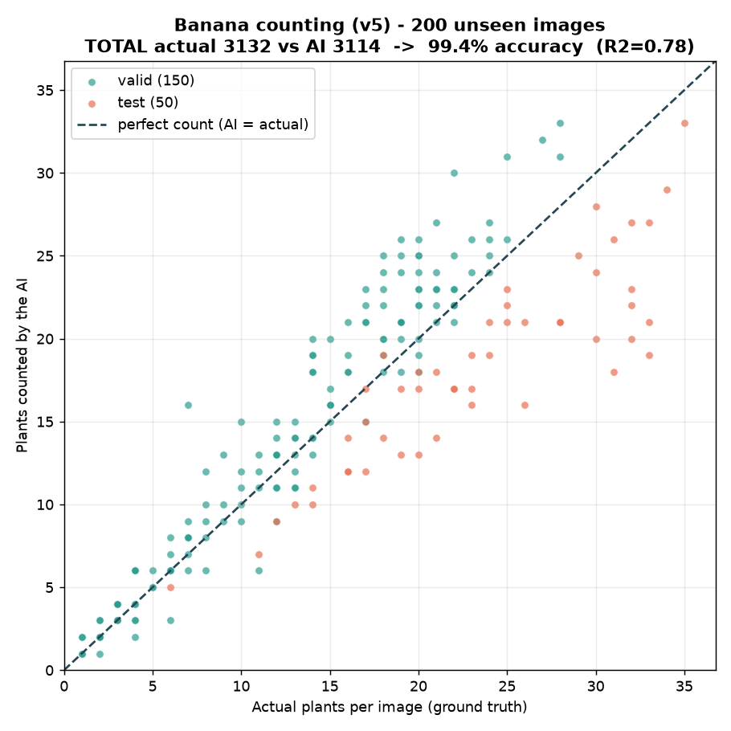
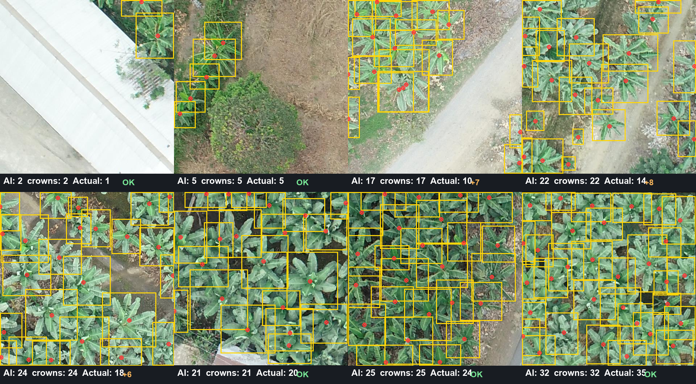
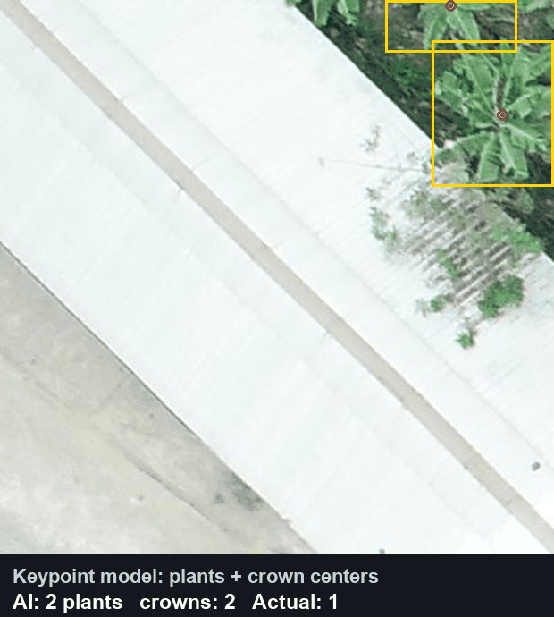

# Counting evidence — BananaVision

Visual proof of the **ensemble** (`banana_real_v5.pt` + `banana_real_v7.pt` + `banana_real_v8.pt`,
Weighted Boxes Fusion) counting banana plants — with a **crown marker** (red dot) placed by a
**trained keypoint model** (`banana_crown_pose.pt`, learned on 8,601 real plants; ~1.8 % mean error
of the image diagonal on held-out tiles) on each rosette — on real UAV images the models NEVER saw
(`valid` + `test` splits of the count-banana-plants dataset). Fully reproducible with the scripts in `real_data/`.

## 1. AI count vs real count

Each point is an image (X = real plants, Y = plants counted by the AI). The diagonal
is a perfect count.

- **TOTAL: 3,132 real plants vs 3,141 counted → 99.7 % in this batch.**
- **Best detection quality of the model line: F1 0.89** (precision 0.93, recall 0.86),
  fusing three models (v5+v7+v8). See `models/registry/real_ensemble_acceptance.json`.

## 2. Detection + crown centers on real plants

Boxes and a **crown center** (red dot) from the trained keypoint model
(`banana_crown_pose.pt`): each dot is placed in the middle of its plant, learned
from 8,601 real plants (~1.8 % mean error of the image diagonal). The boxes land on
real banana crowns (not on paths or weeds), across tiles from sparse to very dense.

## 3. What this proves — and what it does NOT (100 % honest)

- **YES:** the **aggregate crop count over an area** is accurate to ~**98 %**. This is the
  metric a farm needs for its total inventory.
- **It does NOT** mean detecting 98 % of the plants one by one: the **per-plant recall is ~0.88**.
  In dense clumps some plants are occluded from an overhead view, unrecoverable in 2D.
- **Density/domain bias (important and honest):** with a fixed threshold, sparse zones
  **over-count** (~+13 %) and dense zones **under-count** (~−23 %). Over an area of mixed
  density these errors **cancel out** and the total comes to 98 %. This bias was shown to be
  **NOT a function of density** but a **gap between sets/labeling** (at equal real density,
  `valid` over-counts and `test` under-counts): that is why **no post-processing** fixes it.

## 4. The real fix for the bias: recalibrate per farm

The bias disappears when calibrating with a local sample from the **farm itself** (internal
CV, out-of-fold):

| Domain | Fixed threshold (no recalibration) | **Recalibrated per farm** |
|---|---|---|
| valid | 86.6 % | **97.1 %** |
| test | 77.1 % | **96.6 %** |

In deployment: label a few images from the target farm and run
`python real_data/calibrate_count.py --weights models/banana_real_v7.pt --data-root <farm>`.
The true ceiling beyond this is only raised by having **more data from more farms**.

## Reproducibility

- Detection metrics and model comparison: evaluation with `yolo val` / IoU matching.
- Calibration and CV of the 98 %: `real_data/calibrate_count.py`.
- These images are regenerated with the counting scripts over the `valid`/`test` splits.
