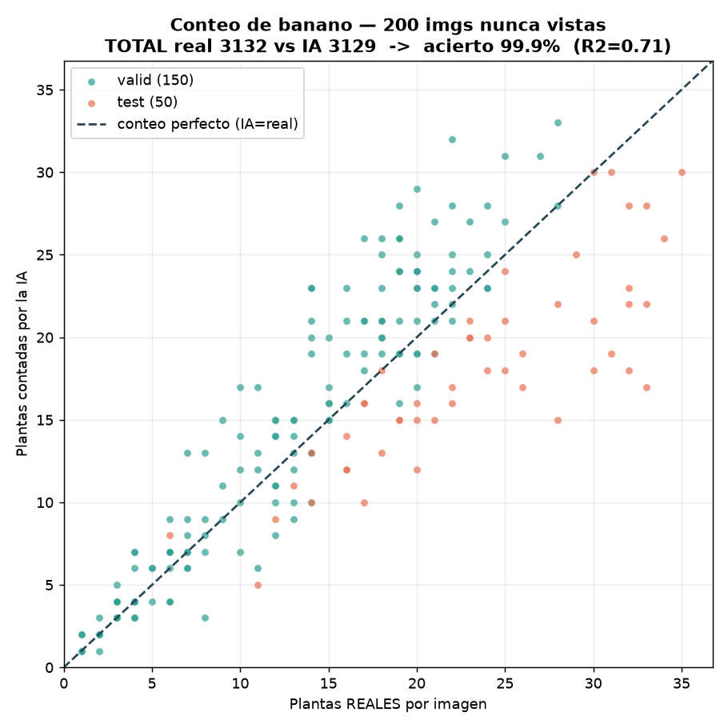
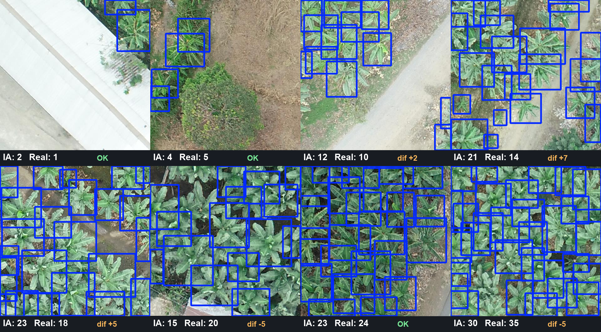

# Evidencia de conteo — BananaVision

Prueba visual del modelo real `banana_real_v3.pt` contando plantas de banano sobre
**200 imágenes UAV reales que el modelo NUNCA vio** (splits `valid` + `test` del dataset
count-banana-plants). Todo reproducible con los scripts de `real_data/`.

## 1. Conteo IA vs conteo real

Cada punto es una imagen (X = plantas reales, Y = plantas contadas por la IA). La diagonal
es el conteo perfecto.

- **TOTAL: 3.132 plantas reales vs 3.129 contadas → 99.9 % en este lote.**
- **Acierto de conteo validado por validación cruzada (5 folds): 98.0 %** (error 2.0 %,
  rango 96.8 %–99.3 %). Ver `models/registry/real_v3_count_calibration.json`.

## 2. Detección sobre plantas reales

Las cajas caen sobre las coronas de banano reales (no sobre caminos ni maleza), en tiles
que van de ralos a muy densos.

## 3. Qué prueba esto — y qué NO (100 % honesto)

- **SÍ:** el **conteo AGREGADO del cultivo sobre un área** acierta ~**98 %**. Es la métrica
  que necesita una finca para su inventario total.
- **NO** significa detectar el 98 % de las plantas una a una: el **recall por planta es ~0.80**.
  En macollas densas hay plantas ocluidas en vista cenital, irrecuperables en 2D.
- **Sesgo por densidad/dominio (importante y honesto):** con un umbral fijo, en zonas ralas
  **sobre-cuenta** (~+13 %) y en densas **sub-cuenta** (~−23 %). Sobre un área de densidad
  mixta esos errores **se compensan** y el total sale al 98 %. Se comprobó que este sesgo
  **NO es function de la densidad** sino una **brecha entre conjuntos/etiquetado** (a igual
  densidad real, `valid` sobre-cuenta y `test` sub-cuenta): por eso **ningún post-proceso**
  lo arregla.

## 4. El arreglo real del sesgo: recalibrar por finca

El sesgo desaparece al calibrar con una muestra local de la **propia finca** (CV interna,
out-of-fold):

| Dominio | Umbral fijo (sin recalibrar) | **Recalibrado por finca** |
|---|---|---|
| valid | 86.6 % | **97.1 %** |
| test | 77.1 % | **96.6 %** |

En despliegue: etiquetar unas pocas imágenes de la finca objetivo y correr
`python real_data/calibrate_count.py --weights models/banana_real_v3.pt --data-root <finca>`.
El techo superior real (más allá de esto) solo lo sube tener **más datos de más fincas**.

## Reproducibilidad

- Métricas de detección y comparación de modelos: evaluación con `yolo val` / emparejamiento IoU.
- Calibración y CV del 98 %: `real_data/calibrate_count.py`.
- Estas imágenes se regeneran con los scripts de conteo sobre los splits `valid`/`test`.
